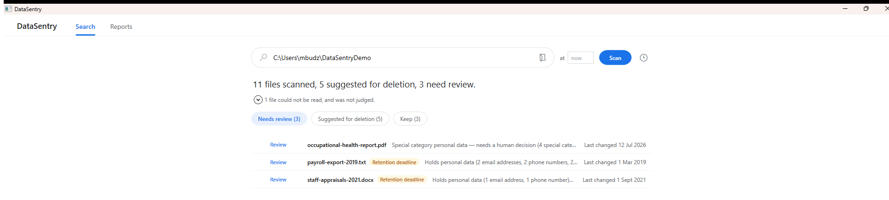
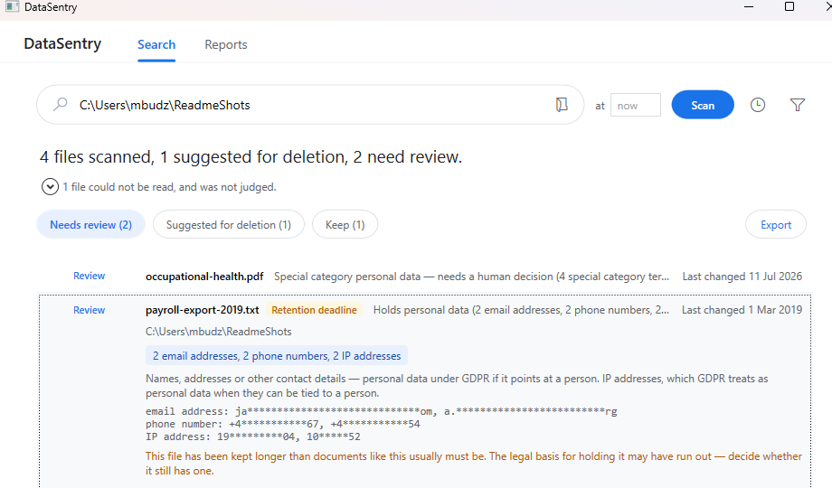

# DataSentry

[](https://github.com/BMichal93/DataSentry/actions/workflows/ci.yml)

DataSentry is a GDPR-aware file cleanup tool for Windows. It scans a directory tree, classifies every file, and produces a recommendation per file:

- **Delete** — junk, temporary, stale, or duplicate files.
- **Retain** — files in active use, or likely under a retention obligation.
- **Review** — files that appear to contain personal data and need a human decision.

DataSentry recommends; the user decides. Nothing is deleted without explicit confirmation, and deletion always means the Windows recycle bin, never a permanent delete.



Every row is judged by the danger it carries, not by the disk space it frees. A row says what was found in the file and why that matters — and it never says what the data *is*.

## The GDPR / PII angle

Shared drives accumulate spreadsheets full of personal data that nobody remembers keeping. Finding those files is DataSentry's main job, and it follows three rules without exception:

- **Only types and counts are ever reported** — "3 phone numbers, 1 IBAN", never the matched values themselves. Not on screen, not in logs, not in the database. A tool that copies the data it was built to police would itself be a liability.
- **Personal data is never auto-deleted.** A PII finding overrides any delete recommendation, because personal data may also be under a legal retention obligation (invoices and tax records typically 5–7 years). Special category data under GDPR Art. 9 — health, biometric, political opinions, and the rest — always lands under Review.
- **Detection is confidence-scored, never binary.** Formats with a checksum are validated (mod-97 for IBAN, Luhn for payment cards, the PESEL checksum) to cut false positives.

Scan reports themselves follow storage limitation (GDPR Art. 5(1)(e)): they are purged automatically 30 days after the scan.

### The retention deadline flag

Personal data may not be kept forever, and a file holding it is not just clutter — it is data whose legal basis for being kept is running out, or already has. So for every file with a PII finding, DataSentry compares the later of its creation and last-edit dates against the typical five-year finance/tax retention period. A file inside the last six months of that period, or past it, earns an amber **Retention deadline** badge, and ordinary personal data that would otherwise have been left to rest is raised to **Review**.

DataSentry cannot know the real obligation attached to any given file — periods differ by document type and jurisdiction. The badge is therefore a prompt for a human decision, never a legal assertion: a breached retention period is a reason to review, not a licence to purge.



## Working through a scan

A finished scan opens on the files that need a decision. Three chips — **Needs review**, **Suggested for deletion**, **Keep** — filter the list, and a row expands in place to show why it was flagged, the kinds of personal data found, and a redacted shape of each match (`48*********12` — the shape, never the value, held only for the session and never written to the database). From there you can:

- **Export** the whole report to a CSV — path, recommendation, types, counts, and the same redacted snippets — to hand to whoever needs to act on it.
- **Send the condemned files to the recycle bin** in one batch, un-ticking any you want to spare. Files that need review are never deletable this way, and nothing is ever a permanent delete.
- **Open a flagged file** to read what is actually in it, where your own access controls already guard it — the report itself never prints the data.

Around the scan, DataSentry keeps a **visible, editable list of folders to skip** — Windows, Program Files, and anything you add, remembered between runs in `settings.json`; **asks before scanning a whole drive**, since `C:\` is hours of walking and as often a slip as a decision; and can **pause a running scan** and resume it exactly where it left off, which is not the same as cancelling it. Scans read personal data out of scanned PDFs and images with **OCR**, and reach files nested past the old 260-character Windows path limit.

## Architecture

Three layers in separate projects, with dependencies pointing inward only:

| Layer | Project | Contains | References |
|---|---|---|---|
| UI | `DataSentry.UI` | WPF views, view models, composition root | Core (and Data at the composition root only) |
| Business logic | `DataSentry.Core` | Domain models, scan engine, classification rules, PII detectors | nothing |
| Data | `DataSentry.Data` | File system access, text extraction, SQLite persistence via EF Core | Core |

`DataSentry.Core` knows nothing about the file system, the database, or the UI — it talks to abstractions (`IFileSource`, `IScanResultStore`) that `DataSentry.Data` implements. That is what makes every classification rule unit-testable without touching a disk.

Each rule (junk, staleness, duplicates) and each PII detector is its own class behind a common interface, so new rules are added without touching existing ones. Scanning is streaming end to end: file contents are hashed lazily and only when a cheaper signal suggests a duplicate, and only the first part of a file is read for PII sampling.

## Build, run, test

Requires the [.NET SDK](https://dotnet.microsoft.com/download) (see `global.json` for the version) on Windows — the UI is WPF and targets `net8.0-windows`.

```powershell
dotnet build DataSentry.sln
dotnet run --project src/DataSentry.UI
dotnet test DataSentry.sln
```

There is nothing to configure: the SQLite database is a file the app creates on first run, and all defaults are chosen in code.

Scans can also run on a daily schedule via the Windows Task Scheduler (the clock icon next to the search bar); scheduled scans run headlessly and their reports appear in the Reports tab.

### A single, self-contained executable

To produce a build that runs on a Windows machine with no .NET installed — one file you can hand to someone and they double-click:

```powershell
dotnet publish src/DataSentry.UI -c Release -r win-x64
```

The output is `DataSentry.exe` (a self-contained, single-file `win-x64` build) alongside a `tessdata` folder holding the OCR language model, which Tesseract opens by path. The native libraries the app depends on — SQLite, Tesseract, and the PDF rasteriser — are bundled into the exe and unpacked on first run. The publish settings live in [`DataSentry.UI.csproj`](src/DataSentry.UI/DataSentry.UI.csproj) and switch on only when a runtime is named, so an ordinary `dotnet build` stays framework-dependent and quick.

For end users, [`docs/how-to-run.md`](docs/how-to-run.md) is the short version: download the exe, pick a folder, scan.

## CI

Every push and pull request builds the solution and runs the full NUnit test suite on `windows-latest` — see [`.github/workflows/ci.yml`](.github/workflows/ci.yml).

## License

Apache 2.0 — see [LICENSE](LICENSE).
